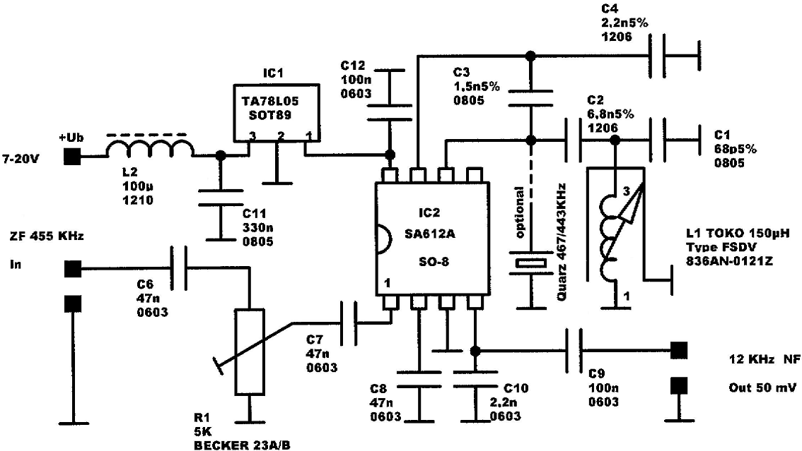
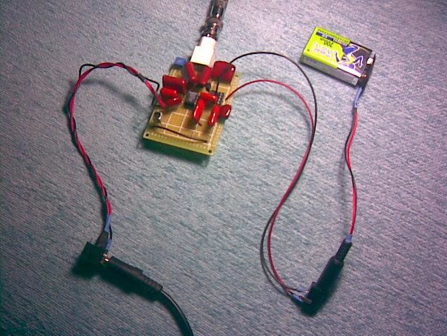
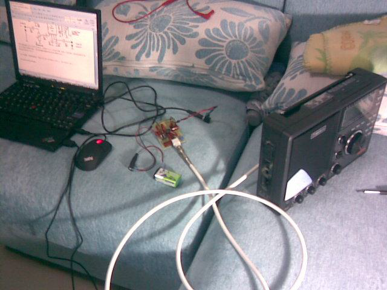
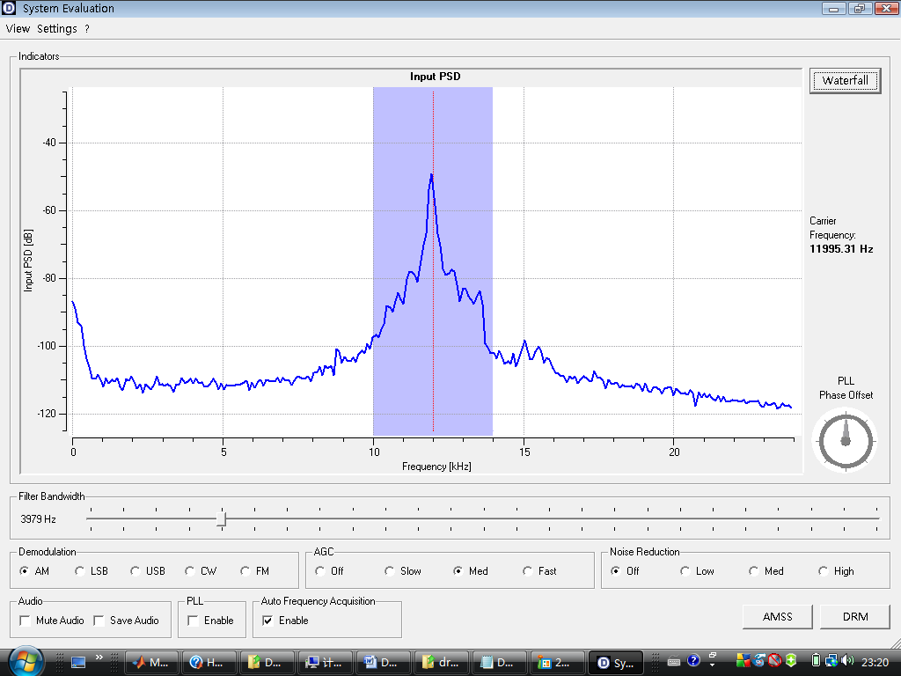
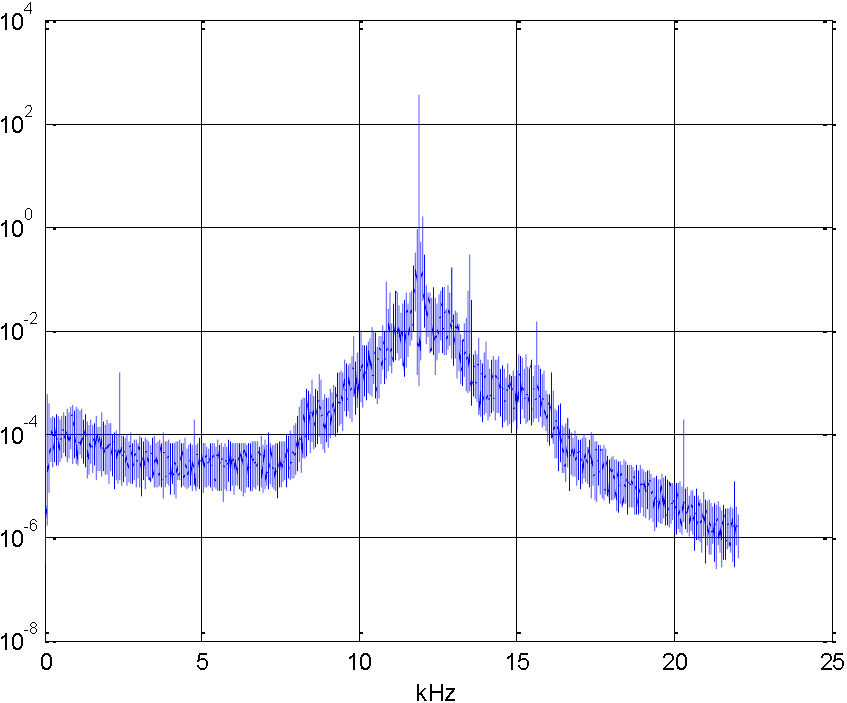
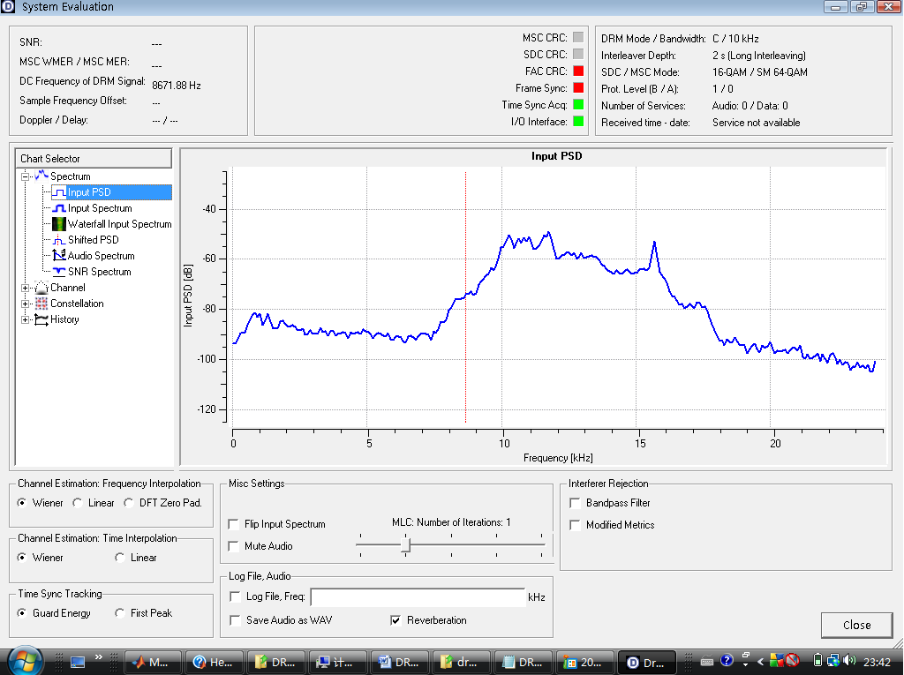

(原文刊于我被关闭的sina博客)

先给出一些跟本文有点关系的一些网站链接： 

http://drm.sourceforge.net/    drm的ofdm一直到声音解码源程序,编译后可以在windows下执行,也有drm真实声卡采集信号,可以用于测试自己的程序,也有许多收音机的drm改装指导 

http://www.amqrp.org/kits/softrock40/ 一种基于计算机声卡的软件化接收机软硬件 

http://www.sat-schneider.de/DRM/DRM.htm    一个DRM设备制造商,我的DRM变频器就是按他们的方案作的. 

http://www.hellocq.net/web/index.php    hellocq当然不能少,国内ham高水平技术社区,大量的diy作品活跃地 

http://gnuradio.org/trac        无线通信技术也可以开源,我期望着通信自由解放的那一天,打倒一切盈利性运营商! 

http://oscar.dcarr.org/ssrp/    一个GNU radio的低成本硬件实现方案; 

DRM是Digital Radio Mondiale的简称,说白了就是30MHz以下的数字广播技术(现在也被扩展到了传统的调频广播88~108MHz频段).中波广播是525~1605kHz,短波广播一般是3MHz~30MHz,又叫HF频段,高频频段.总之30MHz以下存在许多的广播电台在播发调幅广播信号,也有业余无线电爱好者使用单边带方式进行通信，例如LSB或者USB方式，也有SSTV慢扫描电视，卫星云图播发，CW方式即等幅报摩尔斯电码什么的。 
  
不好意思又给人科普上了。 
  
调幅广播有些固有缺点，例如容易受到干扰，音质一般（带宽窄）等等。能不能通过数字化技术提高抗干扰性，提高抗电离层传播导致的多径等各种效应的能力，提高音质？DRM就是定义了在原来调幅广播频带内使用OFDM技术来广播音频信号的技术，OFDM不用多说了，3G LTE长期演进计划，IMT advance，4G，WiMAX，WiFi之类的几乎全用了OFDM技术，OFDM特别适合用在多径严重的环境当中，这个说起来三天也说不完，博士论文主要就是研究的跟OFDM有关的这些东西。 
  
赶紧说说我这两天干啥了吧。 
  
DRM梦想是美好的，一个问题是，传统的收音机只能解调模拟信号，是无法解调OFDM信号的，怎么即能充分利用传统收音机，又能听DRM广播呢？就是依靠计算机。由于自己给人做过地面数字电视中频A/D后采样信号的OFDM解调，于是也想来试验一下解一解DRM信号。 
  
将DRM广播信号导入计算机，是通过声卡采集普通收音机的信号完成的，计算机的声卡说白了就是一个采样率可以高达192kHz的A/D和D/A卡，DRM信号带宽一般也就是10kHz左右（标准规定了5~20kHz的系列模式），因此根据奈奎斯特采样定律计算机声卡的采样率完全有可能胜任DRM信号解调的采样任务。但收音机的中频频率一般是455kHz，即10kHz的DRM信号骑在455kHz的中频载波上，计算机需要无失真采集这个信号，采集收音机对455kHz检波后的信号是没有用的，检波操作对DRM OFDM信号是灾难性的不可恢复损失，必须采集455kHz中频信号上的DRM信号。问题随之而来，计算机声卡目标是采集声音，声音频率范围是20~20kHz，这就意味着声卡上一般会有一个低通滤波滤除20kHz以上频率信号，显然455kHz会被滤掉，无从采集。声卡最高采样率192kHz，按照采样定律，为了保证不发生混叠至少也会做96kHz以下的低通滤波，总之不大会允许455kHz信号直接进入。我做了这样的实验，的确是这样的，信号几乎衰没了。但这其中其实存在一种可能，就是将计算机声卡的低通滤波改造一下，使之可通过455kHz的信号，此时声卡采集相当于中频带通采样，是有可能将455kHz上的DRM信号无失真采进计算机的。但我还没有仔细研究过声卡上的低通滤波器是否容易改造。我目前还是采用了一种成熟做法采集信号，就是将455kHz的中频信号下变频至12kHz，这时候计算机声卡低通滤波器就允许信号无障碍的通过并采集了。 
  
这种做法其实早就有人提出并这么做了，有许许多多方案、程序可用。典型结构如下： 

收音机我选用了国内的乐信的RP2100,它自带455kHz的中频输出接口,省去了我拆收音机焊线引出455kHz信号的麻烦.455kHz至12kHz的变频器是自己DIY的,计算机就遍地都是了,测试软件可以从网络上下载.值得一提的是,按照上面的方案不光可以接收DRM信号,也可以接受其他信号,因为软件实现各种解调方式是十分容易的,比如RP2100不具备单边带、CW、SSTV等接收功能，使用上面的方案之后，利用计算机软件就能实现接收以上信号的功能了。 
  
变频器的电路原理图如下，引自：http://www.sat-schneider.de/DRM/DRM.htm 

图中的阻容值以及芯片型号已经给出，只是那个150uH的振荡线圈（电感）比较难搞，我是用收音机中周自己改绕其中线圈实现的，具体电感量的调整使用电感表测量辅助进行。 

DRM变频器（用洞洞板做的，那些几千p的CBB电容个头真不小，瓷片的会好一些）最后做出来的样子如下： 

最上面是BNC接口，通过同轴连接RP2100的455kHz中频接口，右面是9V电池供电，左面是12kHz输出接口通过3.5mm音频线和插入计算line in或者mic口。 
  
和收音机和电脑连接起来： 

使用http://drm.sourceforge.net/的dream软件进行实时解调：选择settings --> AM (analog) 

可以看到变频后的中心频率在12kHz左右。在北京将收音机调谐在中波639kHz后，就可以从电脑里听到清晰的dream软件解调出的声音了。 
  
感兴趣的还可以用matlab实现非实时离线解调,具体方法如下: 

y  = wavrecord(10*44100, 44100, 1);%用44.1kHz采样率采集10秒钟声卡信号 

P=pwelch(y); semilogy((0:(length(P)-1)).*(44.1/2)./(length(P)-1),P);grid on;xlabel('kHz');%看看采集信号的功率谱 

中间的尖即12kHz载波频率，不断放大发现我的变频器输出的精确频率是11.9038kHz 
  
接下来就可以对y进行离线解调了，matlab提供了现成的解调函数，也可以自己编写。首先给解调设计一个16阶带宽为4kHz的巴特沃兹低通滤波器： 

[num,den] = butter(16,4000/(44100/2)); 

对y进行解调并回放声音： 

z = amdemod(y,11903.8,44100,0,0.0,num,den);wavplay(z, 44100); 

此时一般你会听到10秒钟的解调出的广播声音。 
  
既然已经可以编程序了，那么可作的工作就很多了，改变滤波器设计，设计AGC算法，进行同步检波等等，单边带解调（这个matlab也有现成函数）、SSTV等解调。以上是离线方式。以上内嵌功能其实在simulink中都有对应模块，按道理simulink是可能实现实时解调的，但我的IBM x61笔记本运行simulink也无法实现实时解调，看来得搞一块dsp板，直接让simulink在上面跑才有可能？总觉得现在的计算机硬件应该是能够让simulink实时解调的，毕竟dream软件进行OFDM实时解调也才有很低的cpu占用率，只能怪matlab的simulink的运行效率太低了。 
  
现在就是要试验使用dream软件解调真实电台的DRM OFDM信号了，可惜在hellocq上看到的一些DRM频率我这里都没能成功接收，这些频率如下：15665kHz；12005kHz；15725kHz；15735kHz。只是在15735kHz上可以以较大的概率获得时间同步，偶尔会获得帧同步，倾向于相信真的检测到了DRM信号。 

不知道这两天有人在什么频率上收到过DRM信号，大家交流一下。 
  
改进：发现连接好之后，还是会对收音机灵敏度造成一些影响，有些时候连接好之后会使收音机噪声变大，初步估计是变频器的455kHz输入回路太简单，计算机干扰可能由此进入收音机，是不是输入回路用高输入阻抗的运放缓冲隔离一下比较好，比较有利于减小计算机对收音机的影响？
