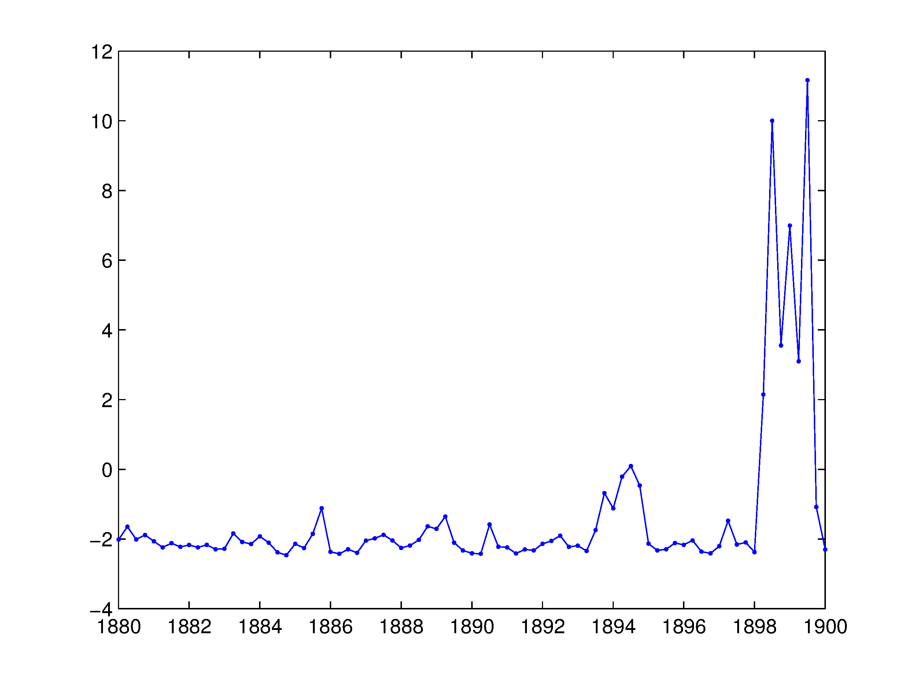

(原文刊于被sina关闭的我的sina博客)

---------最新进展分割线-----------------------------------------------------------------------------------------------

用一个几十块钱的USB电视棒来扫描运营商的LTE信号频谱，以及解调一些小区信息。

关于电视棒软件无线电，rtl-sdr有兴趣的请参见这篇：["rtl-sdr, RTL2832电视棒追踪飞机教程(ADS-B)"](link)

这里只说说我用电视棒扫描LTE信号的的一些结果。

从网上搜到三大运营商的LTE频率为（超出电视棒 E4000 tuner最高调谐频率2200M的频率没写）：

中国移动 1880-1900MHz

中国电信 1755-1785MHZ（上行）/1850-1880MHz（下行）

中国联通 1955-1980MHz（上行）/2145-2170MHz（下行）

因为移动是TDD，所以上下行频率相同，电信和联通是FDD，上下行频率是分开的。

E4k tuner的电视棒，能调到1880～1900MHz（据网上说移动lte是这个频率），820T的tuner是调不到这个频率的。
但是E4K的性能又一般，没办法。

真相时间！

地点40.046787,116.403211，近立水桥，14层楼窗内。北向窗，移动1880-1900MHz，明显的OFDM矩形频谱，陡峭的边沿。

地点40.046787,116.403211，近立水桥，14层楼窗内。南向窗，移动1880-1900MHz，信号比北向弱一些，仍然是陡峭的边沿。
两种可能，天通苑布设了LTE基站？或者是因为南边的楼距离我较近，遮挡严重，导致北窗好一些。

地点39.951908,116.420465，近雍和宫，3层北向室内。
移动1880-1900MHz，没看到LTE OFDM矩形谱，但是1900的那侧似乎有较强的其他信号，这可能是这里不用LTE的原因？通过一些技术配置手段其实LTE是可以在这里用的，但可能移动初期还没有深入去弄这些东西？

--------2014-1-11----------------------------------------

最新发现在立水桥也能扫到小区并解调一些信息，电信已经覆盖这么好了？
  
--------我是2014-1-10更新分割线-----------------------------

在 @piview 的提醒下扫了一下电信和联通的频段，果然有所斩获！

好戏来了。地点39.951908,116.420465，近雍和宫，3层北向室内。
电信1850-1880MHz，实际LTE下行信号占用1850-1870MHz 共20MHz带宽，中心频率1860MHz。

使用LTE-Cell-Scanner （ https://github.com/Evrytania/LTE-Cell-Scanner ）成功解调如下信息：

  Detected a cell!
  
    cell ID: 22
    
    RX power level: -12.1782 dB
    
    residual frequency offset: -39480.6 Hz
    
  Detected a cell!
  
    cell ID: 245
    
    RX power level: -30.5947 dB
    
    residual frequency offset: -57346 Hz

奇怪的是除了中心频率1860，居然在1860.9也检测到一个下行信道，不知道是虚假的还是真的远方小区信号窜过来的。

CID|A |fc     |foff  |RXPWR|C |nRB|P |PR |CrystalCorrectionFactor
---|--|-------|------|-----|--|---|--|---|------------------------
22 |2 |1860M  |-39.5k|-12.2|N |100|N |one|0.99997877433266058045
245|2 |1860.9M|-57.3k|-30.6|N |25 |N |1/6|0.99996918467920425933

