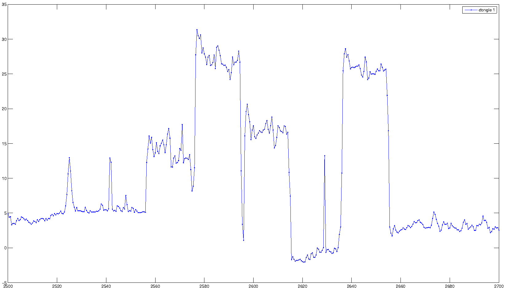
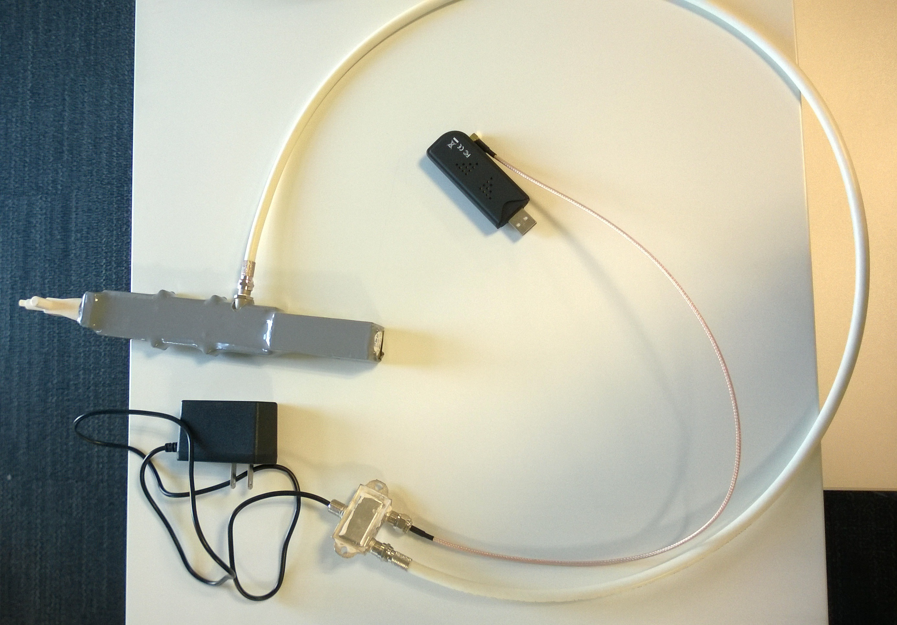

(原文刊于被sina关闭的我的sina博客)

继续折腾rtl-sdr电视棒。

在这篇 [4G LTE(北京)信号捕捉(rtl-sdr 电视棒软件无线电)新扫到电信(LTE SDR Beijing)](http://sdr-x.github.io/4G%20LTE%28%E5%8C%97%E4%BA%AC%29%E4%BF%A1%E5%8F%B7%E6%8D%95%E6%8D%89%28rtl-sdr%20%E7%94%B5%E8%A7%86%E6%A3%92%E8%BD%AF%E4%BB%B6%E6%97%A0%E7%BA%BF%E7%94%B5%29%E6%96%B0%E6%89%AB%E5%88%B0%E7%94%B5%E4%BF%A1%28LTE%20SDR%20Beijing%29/) 里，利用电视棒自身的扫频能力尝试扫描LTE频谱，而在本篇博客里，借鉴了别人的一种电视棒频带扩展方法成功的扫描到D频段的LTE信号! 方法很简单，给电视棒加装一个变频器，且看细细道来。

先来频带扩展之后扫到的D频段真相吧。

第一张图是在雍和宫附近室内扫到的2500～2700Mhz频谱图。

根据这里

[http://it.sohu.com/20131120/n390446437.shtml](http://it.sohu.com/20131120/n390446437.shtml)

的说法，2500～2690为TD-LTE频段，具体为：

中国联通 2555-2575 MHz；

中国移动 2575-2635 MHz；

中国电信 2635-2655 MHz。

和频谱图对应的非常好。图中有4个明显的20MHz宽度矩形谱。

第一个最矮个头的矩形即中国联通的2555-2575

接下来一高一矮两个矩形以及后面的凹槽即中国移动2575-2635

最后一个矩形正好是中国电信2635-2655。
  
第二张图是我用的设备。820t tuner的电视棒加一个MMDS的LNB（本振1998MHz）。

具体频带扩展方法介绍：

大家都知道820t tuner最高频率也就1.7GHz左右，E4000最高大约2.2GHz，对2.5GHz以上望尘莫及。
最近rtl-sdr社区的一个家伙用MMDS的 LNB下变频后用电视棒解调了2.4GHz频段大量的GFSK信号（蓝牙之类的）。
受他启发，到淘宝一搜MMDS LNB，还真有。随即买了一个扫频谱。

图中那个灰色的长家伙即MMDS LNB，白色小圆棒头子是它自己的天线。黑色的电视棒不用说了。
银色的小方块是LNB的电源模块，它一个口给LNB供电，另一个口输出LNB下变频的信号给电视棒。

提供一些接口规格信息给不熟悉的同学（如果也想搞）：

LNB和它的电源模块都是英制F头外螺内孔（阴头）。

你需要两根RF电缆，一根连接电源模块和LNB，另一根连接电源模块和电视棒。

第一根RF电缆两头都得是英制F头内螺内针（阳头）连接电源模块和LNB供电口（电源模块上写着天线的那个口）。

第二根RF电缆：

如果你手头的电视棒是MCX天线接口，也就是那种小型金黄色接头，你需要一根RF电缆：一头是英制F头内螺内针（阳头）连接电源模块转接出来的LNB信号（电源模块上写着电视的那个口），另一头是MCX阳头连接电视棒。

如果你手头的电视棒是IEC天线接口，也就是那种较大的银色接头，你需要一根RF电缆：一头是英制F头内螺内针（阳头）连接电源模块转接出来的LNB信号（电源模块上写着电视的那个口），另一头是IEC阳头连接电视棒。

good luck！
