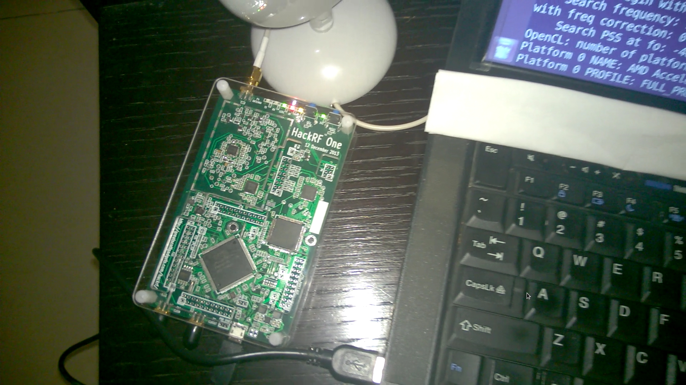

(原文刊于被sina关闭的我的sina博客)

感谢 [http://hackrf.net/](http://hackrf.net/) 借给我HACKRF板供调试！

OpenCL加速的 TDD/FDD LTE小区搜索与跟踪源代码：[https://github.com/JiaoXianjun/LTE-Cell-Scanner](https://github.com/JiaoXianjun/LTE-Cell-Scanner)

因为HACKRF带宽可达20MHz，远高于rtl-sdr电视棒，因此有了HACKRF，将来就可能加入解码LTE SIB信息的功能（程序原来主要针对rtl-sdr电视棒设计，受限于rtl-sdr电视棒带宽，只能解码LTE MIB）

(发现SDR棒子现在有点像树莓派一样热闹，这里有一个覆盖HF的FPGA直采棒子： [http://sdrstick.com/](http://sdrstick.com/)  )

视频演示：
（国内） [http://v.youku.com/v_show/id_XNjk3Mjc1MTUy.html](http://v.youku.com/v_show/id_XNjk3Mjc1MTUy.html)
（国外） [http://www.youtube.com/watch?v=3hnlrYtjI-4](http://www.youtube.com/watch?v=3hnlrYtjI-4)

----------更新------------

这里给出如何用C/C++直接编程调用hackrf： [使用C和C++直接调用HACKRF来支持LTE小区搜索(LTE Cell Scanner by HACKRF(C, C++))](http://sdr-x.github.io/%E4%BD%BF%E7%94%A8C%E5%92%8CC++%E7%9B%B4%E6%8E%A5%E8%B0%83%E7%94%A8HACKRF%E6%9D%A5%E6%94%AF%E6%8C%81LTE%E5%B0%8F%E5%8C%BA%E6%90%9C%E7%B4%A2(LTE%20Cell%20Scanner%20by%20HACKRF(C,%20C++))/)

小区扫描结果：

新增 2360MHz频点，亦庄：
      Detected a TDD cell! At freqeuncy 2360MHz, try 0
        cell ID: 30
         PSS ID: 0
        RX power level: -8.25803 dB
        residual frequency offset: 33678.1 Hz
                         k_factor: 0.999984
    Detected the following cells:
    DPX:TDD/FDD; A: #antenna ports C: CP type ; P: PHICH duration ; PR: PHICH resource type
    DPX CID A      fc   freq-offset RXPWR C nRB P  PR CrystalCorrectionFactor
    TDD  30 1   2360M         33.7k -8.26 N 100 N one 1.000014270593028165

在家碰到一次3 hits！

    Hit        PAR [12.2682]dB
    PSS XCORR  cost 9.21082s
      Detected a FDD cell! At freqeuncy 1860MHz, try 0
        cell ID: 86
         PSS ID: 2
        RX power level: -16.1312 dB
        residual frequency offset: 24503.3 Hz
                         k_factor: 0.999986
      Detected a FDD cell! At freqeuncy 1860MHz, try 0
        cell ID: 142
         PSS ID: 1
        RX power level: -17.1019 dB
        residual frequency offset: 24494.4 Hz
                         k_factor: 0.999986
      Detected a FDD cell! At freqeuncy 1860MHz, try 0
        cell ID: 48
         PSS ID: 0
        RX power level: -19.5743 dB
        residual frequency offset: 24515.2 Hz
                         k_factor: 0.999986
    Detected the following cells:
    DPX:TDD/FDD; A: #antenna ports C: CP type ; P: PHICH duration ; PR: PHICH resource type
    DPX CID A      fc   freq-offset RXPWR C nRB P  PR CrystalCorrectionFactor
    FDD  86 2   1860M         24.5k -16.1 N 100 N one 1.0000131739724291702
    FDD 142 2   1860M         24.5k -17.1 N 100 N one 1.0000131692083715773
    FDD  48 2   1860M         24.5k -19.6 N 100 N one 1.0000131804116960677
