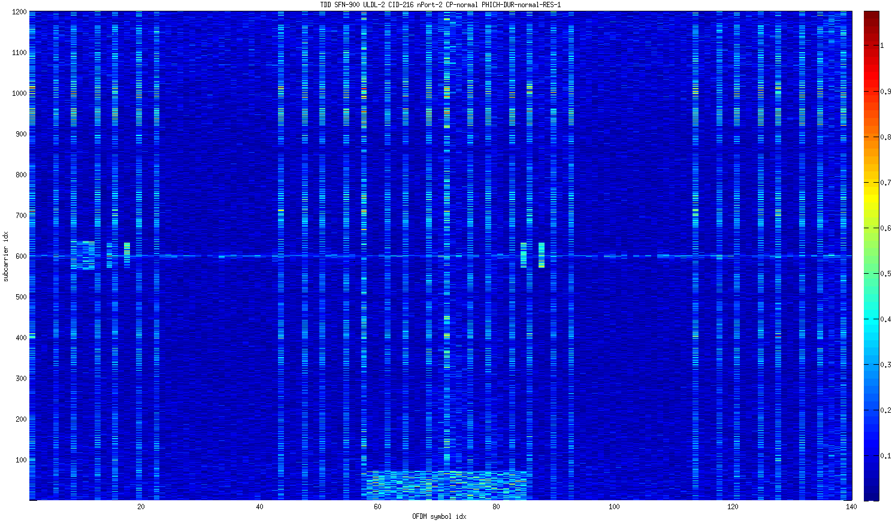

Hi,

I have decode the whole 20MHz LTE signal by HACKRF board with 19.2Msps sampling rate!

See all Matlab codes and captured signal here: [https://github.com/JiaoXianjun/LTE-Cell-Scanner](https://github.com/JiaoXianjun/LTE-Cell-Scanner)
Thanks again to [http://hackrf.net](http://hackrf.net) for lending me a board to do experiment!

For detailed info on parsing RRC SIB in DL-SCH, see this: [How to decode LTE RRC/SIB/ASN1 messages by lameditor and asn1c](http://sdr-x.github.io/LTE-SIB-decoding-by-asn1c/)

Maximum sampling rate of HACKRF is about 20Msps, but 20MHz LTE needs 30.72Msps rate according to LTE spec. 
A sampling rate converter is designed to get 30.72Msps signal from 19.2Msps HACKRF captured signal. (19.2*8/5 = 30.72)
Actually algorithm can run under 19.2Msps if some lengths (symbol, cp, etc.) adjusted carefully. If so, sampling rate conversion
is not necessary.

By this way, those channels in the whole 20MHz LTE bandwidth are detected, 
such as PBCH, PCFICH, PHICH, PDCCH, PDSCH(SIB1, SIB2, etc).

We are lucky for two reasons:
1. Most 20MHz LTE signals here in China are 100RB configuration. That means actual bandwidth is 100*180kHz = 18MHz
2. USB transmission between HACKRF board and computer supports 19.2Msps sampling rate without packets loss. 
Higher rate (for example 23Msps) may lead to packets loss.

Some figures from Matlab are attached.

Figure 1 info: time-frequency resource grids of a TDD radio frame (Y: sub-carrier; X OFDM symbol)

Matlab outputs and these match the Figure 1:

    TDD SFN-310 ULDL-2-|D|S|U|D|D|D|S|U|D|D| CID-30 nPort-1 CP-normal PHICH-DUR-normal-RES-1
    
    SF5 PHICH1 PDCCH3 RNTI: SI-RNTI SI-RNTI
    No.0 4CCE: Localized VRB from RB0 to RB6 MCS-2 HARQ-0 NEWind-0 RV-1 TPC-1 DAI-0
    No.0 8CCE: Localized VRB from RB0 to RB6 MCS-2 HARQ-0 NEWind-0 RV-1 TPC-1 DAI-0

Figure 2 : Constellation of SIB1 in PDSCH of subframe 5 in above radio frame

Figure 3 info: time-frequency resource grids of another TDD radio frame (Y: sub-carrier; X OFDM symbol)

Matlab outputs and these match the Figure 3:

    TDD SFN-900 ULDL-2-|D|S|U|D|D|D|S|U|D|D| CID-216 nPort-2 CP-normal PHICH-DUR-normal-RES-1
    SF4 PHICH1 PDCCH1 RNTI: SI-RNTI SI-RNTI
    No.0 4CCE: Localized VRB from RB0 to RB5 MCS-2 HARQ-0 NEWind-0 RV-0 TPC-1 DAI-0
    No.0 8CCE: Localized VRB from RB0 to RB5 MCS-2 HARQ-0 NEWind-0 RV-0 TPC-1 DAI-0
    SF5 PHICH1 PDCCH1 RNTI: SI-RNTI SI-RNTI
    No.0 4CCE: Localized VRB from RB0 to RB5 MCS-2 HARQ-0 NEWind-0 RV-3 TPC-1 DAI-0
    No.0 8CCE: Localized VRB from RB0 to RB5 MCS-2 HARQ-0 NEWind-0 RV-3 TPC-1 DAI-0

Videos:

outside China: [http://youtu.be/2JH_EGdHyYE](http://youtu.be/2JH_EGdHyYE)

in China: [http://v.youku.com/v_show/id_XNzE3NDYwMDgw.html](http://v.youku.com/v_show/id_XNzE3NDYwMDgw.html)

Next step: decoding PDSCH and porting all these into C/C++ in LTE-Cell-Scanner.

------------------update---------------------

HI,

In previous work, I just got raw bits from PDSCH. 
Now, ASN1 decoder is built based on lameditor and asn1c. 
That means we have almost full stack from A/D samples to PDSCH output and ASN1 parser for LTE Downlink RRC messages.

A article on "How to decode LTE RRC/SIB/ASN1 messages by lameditor and asn1c" is written: 
[http://sdr-x.github.io/LTE-SIB-decoding-by-asn1c/](http://sdr-x.github.io/LTE-SIB-decoding-by-asn1c/)

Have fun.

(I plan to move this Matlab-C mixed program to pure C, 
and accelerate it by fixed-point/parallel to achieve real-time processing LTE Downlink signal. 
Anyone who is interested in this project, feel free to join!)

<noscript>Please enable JavaScript to view the <a href="http://disqus.com/?ref_noscript">comments powered by Disqus.</a></noscript>

