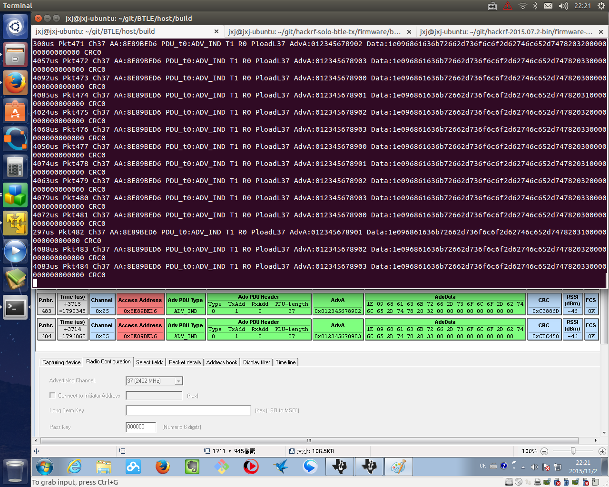

This is extended from my [btle_tx project](http://sdr-x.github.io/A%20BTLE%20%28Bluetooth%20Low%20energy%29%20BT4.0%20radio%20packet%20sender%20%28BladeRF,%20HACKRF%29/)

Now all BTLE channels (0~39, bothe ADV and DATA channels) are supported. You can use btle_tx and btle_rx to send or sniff on any BTLE channel.

A Raw mode is added to both btle_tx and btle_rx. Under this mode, after access addr is detected, following raw 42 bytes (without descrambling, parsing) are printed out. By this way, you can do other experiments or communication between HACKRF boards easily.

[Introduction source code and usage](https://github.com/JiaoXianjun/BTLE)

[youtube video](https://youtu.be/9LDPhOF2yyw)

[video in China](https://vimeo.com/144574631)

Snapshots of HACKRF BTLE packet sniffer VS TI's packet sniffer under fastest flow of continuous/non-gap BTLE packets sequence to demonstrate full real-time processing ability. They capture the same amount of packets and contents:

<noscript>Please enable JavaScript to view the <a href="http://disqus.com/?ref_noscript">comments powered by Disqus.</a></noscript>

